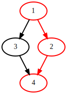

# DataFlowTasks.jl

[](https://maltezfaria.github.io/DataFlowTasks.jl/stable)
[](https://maltezfaria.github.io/DataFlowTasks.jl/dev)
[](https://github.com/maltezfaria/DataFlowTasks.jl/actions)
[](https://codecov.io/gh/maltezfaria/DataFlowTasks.jl)


`DataFlowTasks.jl` is a Julia package dedicated to parallel programming on multi-core shared memory CPUs. From user annotations (READ, WRITE, READWRITE) on program data, `DataFlowTasks.jl` automatically infers dependencies between parallel tasks.

The usual linear algebra data types (Julia arrays) are particularly easy to use with `DataFlowTasks.jl`.

## Installation

```julia
using Pkg
Pkd.add("https://github.com/maltezfaria/DataFlowTasks.jl.git")
```

## Basic Usage

The use of a `DataFlowTask`s is intended to be as similar to a Julia native `Task`s as possible. The API implements these three macros :
* `@dspawn`
* `@dtask`
* `@dasync`

which behaves like there `Base` counterparts, except they need additional annotations to specify access modes. This is done with the three macros :
* `@R`
* `@W`
* `@RW`

where, in a function argument or at the beginning of a task block, `@R(A)` implies that A will be in read mode in the function/block.

Let's look at how it can parallelize with safety insurance.

```@example
using DataFlowTasks
using GraphViz

DataFlowTasks.reset!()
write!(X, alpha) = (X .= alpha)
readwrite!(X) = (X .+= 2)
n = 1000
A = ones(n)
function ex()
    @dspawn readwrite!(@RW(A))              # 1
    @dspawn write!(@W(@view A[1:500]), 2)   # 2
    @dspawn write!(@W(@view A[501:n]), 3)   # 3
    @dspawn readwrite!(@RW(A))              # 4
end
DataFlowTasks.sync()
DataFlowTasks.dagplot()
```



This will generate the DAG (Directed Acyclic Graph) above that represents the dependencies between tasks. This means that the task 2 and 3 can be run in parallel. We see how it's the memory that matters here.

## Example : Parallel Cholesky Factorization

The Cholesky factorization algorithm takes a symmetric positive definite matrix A and finds a lower triangular matrix L such that `A = LLᵀ`. The tiled version of this algorithm decomposes the matrix A into tiles of even sizes. At each step of the algorithm, we do a Cholesky factorization on the diagonal tile, use a triangular solve to update all of the tiles at the right of the diagonal tile, and finally update all the tiles of the submatrix with a schur complement.

So we have 3 types of tasks : the Cholesky factorization (I), the triangular solve (II), and the schur complement (III).  
If we have a matrix A decomposed in `n x n` tiles, then the algorithm will have `n` steps. It implies that the step `i ∈ [1:n]` do `1` time (I), `(i-1)` times (II), and `(i-1)²` times (III). We illustrate the 2nd step of the algorithm in the following image.


The code of the sequential yet tiled factorization algorithm will be :

```julia
tilerange(ti, ts) = (ti-1)*ts+1:ti*ts
function cholesky_tiled!(A, ts)
    m,n = size(A)
    n%ts != 0 && error("Tilesize doesn't fit the matrix")
    tn = n÷ts

    for ti in 1:tn
        ri = tilerange(ti, ts)

        # Diagonal cholesky serial factorization (I)
        cholesky!(view(A,ri,ri))

        # Left blocks update (II)
        L = adjoint(UpperTriangular(view(A,ri,ri)))
        for tj in ti+1:tn
            rj = tilerange(tj, ts)
            ldiv!(L, view(A,ri,rj))
        end

        # Submatrix update (III)
        for tj in ti+1:tn
            for tk in tj:tn
                rj = tilerange(tj, ts)  ;  rk = tilerange(tk, ts)
                mul!(view(A,rj,rk), adjoint(view(A,ri,rj)), view(A,ri,rk))
            end
        end
    end

    # Construct the factorized object
    return Cholesky(A,'U',zero(LinearAlgebra.BlasInt))
end
```

When it will come to actually parallelize the code, we would only have with DataFlowTasks to wrap function calls within a `@dspawn`, and add a synchronization point at the end. The parallelized code will be :

```julia
using DataFlowTasks
using LinearAlgebra
function cholesky_tiled!(A, ts)
    m,n = size(A)
    n%ts != 0 && error("Tilesize doesn't fit the matrix")
    tn = n÷ts

    Atile = [view(A, tilerange(ti, ts), tilerange(tj, ts)) for ti in 1:tn, tj in 1:tn]

    for ti in 1:tn
        # Diagonal cholesky serial factorization (I)
        @dspawn cholesky!(@RW(Atile[ti,ti])) label="chol ($ti,$ti)"


        # Left blocks update (II)
        L = adjoint(UpperTriangular(Atile[ti,ti]))
        for tj in ti+1:tn
            @dspawn ldiv!(@R(L), @RW(Atile[ti,tj])) label="ldiv ($ti,$tj)"
        end

        # Submatrix update (III)
        for tj in ti+1:tn
            for tk in tj:tn
                Ajk = Atile[tj,tk]
                Aik = Atile[ti,tk]
                Aji = adjoint(Atile[ti,tj])
                @dspawn mul!(@RW(Ajk), @R(Aji), @R(Aik), -1, 1) label="schur ($tj,$tk)"
            end
        end
    end
    # Construct the factorized object
    r = @dspawn Cholesky(A,'U',zero(LinearAlgebra.BlasInt))
    return fetch(r)
end
```

If you run this code, you'll see `memory_overlap` warning on the fact that there's no method to evaluate the memory overlaping between an `Adjoint` and a `SubArray`. So we have to implement this method :

```julia
using DataFlowTasks: memory_overlap
memory_overlap(U::Adjoint,A) = memory_overlap(U.parent,A)
memory_overlap(U,L::Adjoint) = memory_overlap(L,U)
```

The code below shows how to use this `cholesky_tiled!` function, how to profile the program and get the most information from the visualization. 

```julia
import DataFlowTask as DFT

# DataFlowTasks environnement setup
DFT.reset!()
DFT.enable_log()
DFT.setscheduler!(DFT.JuliaScheduler(50))

# Context
n  = 4096
ts = 512
A = rand(n, n)
A = (A + adjoint(A))/2
A = A + n*I

# Compilation
cholesky_tiled!(copy(A), ts)

# Reset environnement
DFT.resetlogger!()
GC.gc()

# Real work to be analysed
F = cholesky_tiled!(A ,ts)
@info err  = norm(F.L*F.U-A,Inf)/max(norm(A),norm(F.L*F.U))

# Parallel Trace Plot
DFT.plot(categories=["chol", "ldiv", "schur"])

# Dag Plot
DFT.dagplot()
```

## Profiling

The next results are obtained with a slightly modified version of the function presented above. We used the `LoopVectorization` for the serial cholesky (I), `TriangularSolve`'s `ldiv!` and `Octavian`'s `matmul_serial!`.

The package `TiledFactorization` contains this implementation, you can use it with the following lines :

```julia
import Pkg
Pkg.add("https://github.com/maltezfaria/TiledFactorization.git")
using TiledFactorization: cholesky!
```

DataFlowTasks comes with 2 main profiling tools whose outputs for the case presented above, with a matrix of size (2000, 2000) divided in blocks of (500, 500), are as follows :

The parallel trace plot, that carries other general information :


and the DAG (graph), that represent dependencies between tasks :


We'll cover in details the usage and possibilities of the visualization in the documentation.

Note that the visualization tools are not loaded by default, it requires a `Makie` backend and/or `GraphViz` loaded in the REPL. It's meant to be used in development, so it won't pollute the environment you want to use DFT in.

# Performances

We compare the performances achieved with this version of the Cholesky factorization with the MKL one, and we obtain the next figure. Here the blocks are of size (256, 256).

