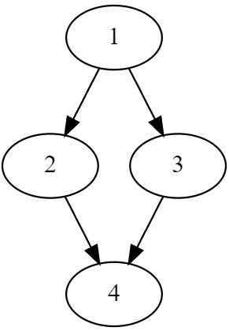
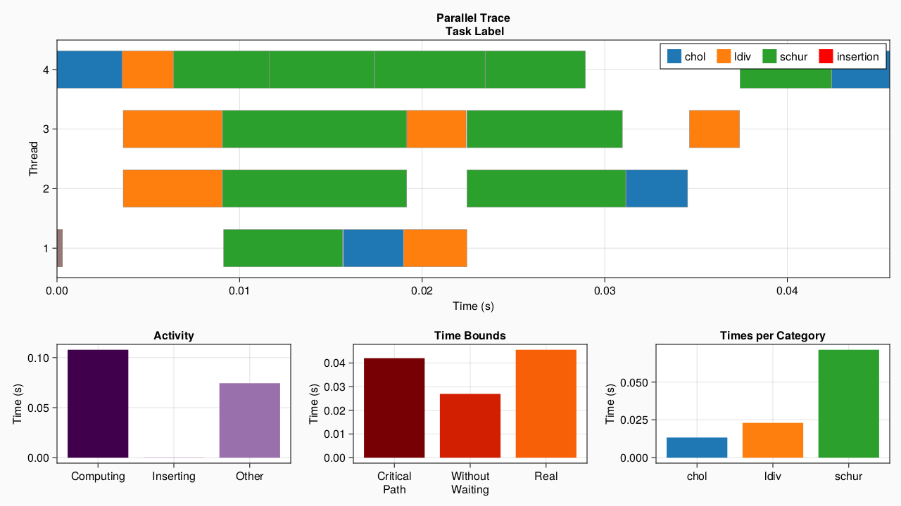
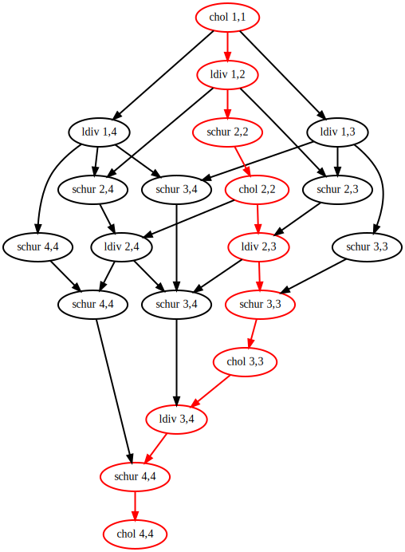

# DataFlowTasks.jl

[](https://maltezfaria.github.io/DataFlowTasks.jl/stable)
[](https://maltezfaria.github.io/DataFlowTasks.jl/dev)
[](https://github.com/maltezfaria/DataFlowTasks.jl/actions)
[](https://codecov.io/gh/maltezfaria/DataFlowTasks.jl)


`DataFlowTasks.jl` is a Julia package dedicated to parallel programming on multi-core shared memory CPUs. From user annotations (READ, WRITE, READWRITE) on program data, `DataFlowTasks.jl` automatically infers dependencies between parallel tasks.

The usual linear algebra data types (Julia arrays) are particularly easy to use with `DataFlowTasks.jl`.

## Installation

```julia
using Pkg
Pkd.add("https://github.com/maltezfaria/DataFlowTasks.jl.git")
```

## Basic Usage

The use of a `DataFlowTask`s is intended to be as similar to a Julia native `Task`s as possible. The API implements these three macros :
* `@dspawn`
* `@dtask`
* `@dasync`

which behaves like there `Base` counterparts, except they need additional annotations to specify access modes. This is done with the three macros :
* `@R`
* `@W`
* `@RW`

where, in a function argument or at the beginning of a task block, `@R(A)` implies that A will be in read mode in the function/block.

Let's look at how it can parallelize with safety insurance.

```julia
write!(X, alpha) = (X .= alpha)
readwrite!(X) = (X .+= 2)

n = 1000
A = ones(n)

@dspawn write!(@R(A), 1)          # 1
@dspawn write!(@R(A[1:500]), 2)   # 2
@dspawn write!(@R(A[501:n]), 3)   # 3
@dspawn begin                     # 4
  @RW A
  readwrite!(A)
end

DataFlowTasks.sync()
```

This will generate the DAG (Directed Acyclic Graph) below that represents the dependencies between tasks. This means that the task 2 and 3 can be run in parallel. We see how it's the memory that matters here.



Another primary tool is the `PseudoTiledMatrix` data structure. A lot of DataFlowTasks' usage concerns tiled matrix. It acts like a tiled view of the matrix, where `A[ti,tj]` gives a view of the tile `(ti,tj)`.  

It will be useful when we want to manipulate part of the matrix as individual objects. We will often encounter the case where we want to specify that "a tile" depends on "another tile". If we don't have those semantically independant objects (tiles), we only have the whole matrix to specify those dependencies. 
A simple usage example :

!!! To be made runnable !!!  
```julia
using DataFlowTasks: PseudoTiledMatrix
A  = rand(10,10)
At = PseudoTiledMatrix(A, 5)
At[2,1]
```

## Example : Parallel Cholesky Factorization

The Cholesky factorization algorithm takes a symmetric positive definite matrix A and finds a lower triangular matrix L such that `A = LLᵀ`. The tiled version of this algorithm decomposes the matrix A into tiles of even sizes. At each step of the algorithm, we do a Cholesky factorization on the diagonal tile, use a triangular solve to update all of the tiles at the right of the diagonal tile, and finally update all the tiles of the submatrix with a schur complement.

So we have 3 types of tasks : the Cholesky factorization (I), the triangular solve (II), and the schur complement (III).  
If we have a matrix A decomposed in `n x n` tiles, then the algorithm will have `n` steps. It implies that the step `i ∈ [1:n]` do `1` time (I), `(i-1)` times (II), and `(i-1)²` times (III). So respectively `O(n)` (I), `O(n²)` (II), and `O(n³)` (III). We will compare this result with the "Times Per Category" part of the visualization. We illustrate the 2nd step of the algorithm in the following image.


The code of the sequential yet tiled factorization algorithm will be :

```julia
using TriangularSolve:ldiv
using Octavian:matmul_serial!
using LinearAlgebra
function cholesky!(A::PseudoTiledMatrix)
    m,n = size(A)
    for i in 1:m
        # Diagonal cholesky serial factorization (I)
        serial_cholesky!(A[i,i])

        # Left blocks update (II)
        L = adjoint(UpperTriangular(A[i,i]))
        for j in i+1:n
            ldiv!(L,A[i,j], Val(false))
        end

        # Submatrix update (III)
        for j in i+1:m
            for k in j:n
                Aji = adjoint(A[i,j])
                matmul_serial!(A[j,k], Aji, A[i,k], -1, 1)
            end
        end
    end

    # Construct the factorized object
    return Cholesky(A.data,'U',zero(LinearAlgebra.BlasInt))
end
```

When it will come to actually parallelize the code, we would only have with DataFlowTasks to wrap function calls within a `@dspawn`, and add a synchronization point at the end. The parallelized code will be :

```julia
function cholesky!(A::TiledMatrix)
    m,n = size(A)
    for i in 1:m
        # Diagonal cholesky serial factorization (I)
        @dspawn serial_cholesky!(@RW(A[i,i]))

        # Left blocks update (II)
        L = adjoint(UpperTriangular(A[i,i]))
        for j in i+1:n
            @dspawn ldiv!(@R(L), @RW(A[i,j]), Val(false)) 
        end

        # Submatrix update (III)
        for j in i+1:m
            for k in j:n
                Aji = adjoint(A[i,j])
                @dspawn matmul_seria!(@RW(A[j,k]), @R(Aji), @R(A[i,k]), -1, 1)
            end
        end
    end
    DataFlowTasks.sync()
    # Construct the factorized object
    return Cholesky(A.data,'U',zero(LinearAlgebra.BlasInt))
end
```

The presented cholesky tiled factorization using DataFlowTasks is implemented in the package `TiledFactorization`, which can be used with :

```julia
import Pkg
Pkg.add("https://github.com/maltezfaria/TiledFactorization.git")
```

The code below shows how to use the `cholesky!` function from this package, how to profile the program and get the most information from the visualization. 

```julia
using DataFlowTasks
using DataFlowTasks: resetlogger!, plot, dagplot
using TiledFactorization
using TiledFactorization: cholesky!
using CairoMakie
using LinearAlgebra

# DataFlowTasks environnement setup
DataFlowTasks.enable_log()
DataFlowTasks.setscheduler!(JuliaScheduler(50))

# Context
tilesizes = 256
TiledFactorization.TILESIZE[] = tilesizes
n = 2048
A = rand(n, n)
A = (A + adjoint(A))/2
A = A + n*I

# Compilation
cholesky!(copy(A))

# Reset environnement
resetlogger!()
GC.gc()

# Real work to be analysed
cholesky!(A)

# Plot
plot(categories=["chol", "ldiv", "schur"])
```

## Profiling

We can illustrate the parallelization implied by those modifications. `DataFlowTasks.jl` comes with 2 main profiling tools whose outputs for the case presented above, with a matrix of size (2000, 2000) divided in blocks of (500, 500), are as follows :




We'll cover in details the usage and possibilities of the visualization in the documentation.

Note that the visualization tools are not loaded by default, it requires a `Makie` backend and/or `GraphViz` loaded in the REPL. It's meant to be used in development, so it won't pollute the environment you want to use DFT in.

# Performances

We compare the performances achieved with this version of the Cholesky factorization with the MKL one, and we obtain the next figure. Here the blocks are of size (256, 256).

