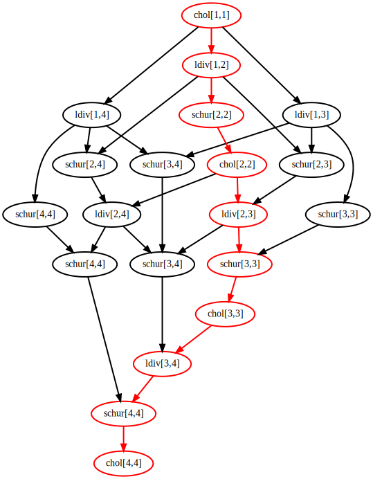

# [Examples](@id examples-section)

TODO: 
- add a description of the examples and more hardware info
- mention the effects of `tilesize` ahd `capacity` on the results of tiled factorization
- compare 'fork-join' approach to `HLU` to dataflow approach

## Tiled Matrix
!!!!!!!! PseudoTiledMatrix in DataFlowTasks ? !!!!!!!!!!!

A lot of DataFlowTasks' usage concerns tiled matrix. We will use in some of the below examples the `PseudoTiledMatrix` data structure. It acts like a tiled view of the matrix, where `A[ti,tj]` gives a view of the tile `(ti,tj)`.  

It will be useful when we want to manipulate part of the matrix as objects. We will often encounter the case where we want to specify that "a tile" depends on "another tile". If we don't have those semantically independant objects (tiles), we only have the whole matrix to specify those dependencies. 
A simple usage example :

!!! To be made runnable !!!  
```julia
using DataFlowTasks: PseudoTiledMatrix
A  = rand(10,10)
At = PseudoTiledMatrix(A, 5)
At[1,1]
```
 
## [Tiled Cholesky factorization](@id tiledcholesky-section)

The Cholesky factorization algorithm takes a symmetric positive definite matrix A and finds a lower triangular matrix L such that `A = LLᵀ`. The tiled version of this algorithm decomposes the matrix A into tiles of even sizes. At each step of the algorithm, we do a Cholesky factorization on the diagonal tile, use a triangular solve to update all of the tiles at the right of the diagonal tile, and finally update all the tiles of the submatrix with a schur complement.

So we have 3 types of tasks : the Cholesky factorization (I), the triangular solve (II), and the schur complement (III).  
If we have a matrix A decomposed in `n x n` tiles, then the algorithm will have `n` steps. It implies that the step `i ∈ [1:n]` do `1` time (I), `(i-1)` times (II), and `(i-1)²` times (III). So respectively `O(n)` (I), `O(n²)` (II), and `O(n³)` (III). We will compare this result with the "Times Per Category" part of the visualization. We illustrate the 2nd step of the algorithm in the following image.


The code of the sequential yet tiled factorization algorithm will be :

```julia
using TriangularSolve:ldiv
using Octavian:matmul_serial!
using LinearAlgebra
function cholesky!(A::PseudoTiledMatrix)
    m,n = size(A)
    for i in 1:m
        # Diagonal cholesky serial factorization (I)
        serial_cholesky!(A[i,i])

        # Left blocks update (II)
        L = adjoint(UpperTriangular(A[i,i]))
        for j in i+1:n
            ldiv!(L,A[i,j], Val(false))
        end

        # Submatrix update (III)
        for j in i+1:m
            for k in j:n
                Aji = adjoint(A[i,j])
                matmul_serial!(A[j,k], Aji, A[i,k], -1, 1)
            end
        end
    end

    # Construct the factorized object
    return Cholesky(A.data,'U',zero(LinearAlgebra.BlasInt))
end
```

When it will come to actually parallelize the code, we would only have with DataFlowTasks to wrap function calls within a `@dspawn`, and add a synchronization point at the end. The parallelized code will be :

```julia
function cholesky!(A::TiledMatrix)
    m,n = size(A)
    for i in 1:m
        # Diagonal cholesky serial factorization (I)
        @dspawn serial_cholesky!(@RW(A[i,i]))

        # Left blocks update (II)
        L = adjoint(UpperTriangular(A[i,i]))
        for j in i+1:n
            @dspawn ldiv!(@R(L), @RW(A[i,j]), Val(false)) 
        end

        # Submatrix update (III)
        for j in i+1:m
            for k in j:n
                Aji = adjoint(A[i,j])
                @dspawn matmul_seria!(@RW(A[j,k]), @R(Aji), @R(A[i,k]), -1, 1)
            end
        end
    end
    DataFlowTasks.sync()
    # Construct the factorized object
    return Cholesky(A.data,'U',zero(LinearAlgebra.BlasInt))
end
```

The presented cholesky tiled factorization using DataFlowTasks is implemented in the package `TiledFactorization`, which can be used with :

```julia
import Pkg
Pkg.add("https://github.com/maltezfaria/TiledFactorization.git")
```

The code below shows how to use the `cholesky!` function from this package, how to profile the program and get the most information from the visualization. 

```julia
using DataFlowTasks
using DataFlowTasks: resetlogger!, plot, dagplot
using TiledFactorization
using TiledFactorization: cholesky!
using CairoMakie
using LinearAlgebra

# DataFlowTasks environnement setup
DataFlowTasks.enable_log()
DataFlowTasks.setscheduler!(JuliaScheduler(50))

# Context
tilesizes = 256
TiledFactorization.TILESIZE[] = tilesizes
n = 2048
A = rand(n, n)
A = (A + adjoint(A))/2
A = A + n*I

# Compilation
cholesky!(copy(A))

# Reset environnement
resetlogger!()
GC.gc()

# Real work to be analysed
cholesky!(A)

# Plot
plot(categories=["chol", "ldiv", "schur"])
```


We'll now see how we can use this visualization to understand the program and its progress.

### Setup
But first, let's look closely at the details that will make this code do a proper profiling. The steps are the following :
- `DataFlowTasks.enable_log()` needs to be called before the benchmark
- `First call` : the call on a copy of A will compile the function, otherwise the first time you'll run it, you will have false results
- `Reset environnement` : because of this call, you need to reset the environnement : all DataFlowTasks' stored informations must be cleaned. This is done with `resetlogger!()`
- `GC.gc()` : the garbage collector call is not a necessary step, but if you have a full REPL, the garbage collection might happen during your benchmark. The profiling visualization will then highlight it.
- 
!!!!!! See common problems to look at the consequences of those steps being forgotten. !!!!!!!!

### Task colors : get an idea of the progress

We can see the algorithm's progress we described above : we have a first blue task (I), then O(n-i) orange (II), then O((n-i)^2) greens (III). We can see the repartition of the time depending on thoses categories we defined on the "Times per Category" plot. Using well choosen labels can increase readability a lot.

### Insertion Tasks

Red tasks represent the time spent inserting nodes in the graph. We specified a capacity of 50 nodes for the scheduler with the line `DataFlowTasks.setscheduler!(JuliaScheduler(50))
`. It means if we have 50 nodes in the DAG, the scheduler will wait until some tasks are finished to insert more nodes in the DAG. If we have too much node in the graph, the algorithm of insertion will cost more. Tests are needed to find the best capacity for each case. Note that the insertion tasks are always handled by the first thread.

### Time Bounds

The "Activity" and "Time Bounds" parts of the plots highlight the time spent waiting ("Other" and "Without Waiting" respectively). This time is in part due to the algorithm, in other part to the scheduler. To differentiate both effects, we must compare the three bars on the "Time Bounds" part.
- `Critical Path` : the time of the longest path in the DAG. It means if we had an infinite number of cores, we couldn't do better than this time : it's the algorithm that limits the parallelization.
- `Without Waiting` : this doesn't consider the algorithm at all.
Seeing here how the `Critical Path` bar is twice as small as the `Real` one tells us that we can't do better than a 2 times speedup. The `Without Waiting` tells us how much the threads are used. Because we know it's not the algorithm that limits us in that situation, it tells us directly the DataFlowTasks' overhead.

Note : The grey parts of the trace plot don't represent anything : it's the separator between all tasks (so they don't merge). Usually, the insertion tasks are very close to each other, and so there might be a lot a grey, and not that much of red. To avoid that, using GLMakie's interactivity, you can zoom on these parts to see exactly what's happening (the grey parts are adaptive).

### DAG

```julia
dagplot()
```


The more the DAG will be wide, the more it can be parallelized. The more it is thin, the less we are going to benefit from having a lot of cores. In this approach, even if there's a lot of nodes, it can be useful to plot the DAG to see its width. It's a visual complement to the "Critical Path" bar in the "Time Bounds" plot : the more this bar is small compared to the "real time", the more the DAG is wide.

The DAG can also be used with smaller versions of the algorithm, while in development : you can check exactly what's the order the program understood and if it's the correct one. The use of labels can help a lot in that process. Here is the DAG obtain with twice less tasks than before.




We can see that as the algorithm progresses, the DAG becomes thinner, and so the parallelization is less optimal. Indeed, we do notice more waiting times at the end of the trace plot than at the beginning.

### Computer 1


### Computer 2


## Gauss-Seidel
The Gauss-Seidel algorithm uses the following five-points stencil :  
$$v_{i,j}^{n+1} = \frac{1}{4}(v_{i,j-1}^{n+1} + v_{i,j-1}^{n+1} + v_{i,j}^n + v_{i+1,j}^n + v_{i,j+1}^n)$$ 
where the element $(i,j)$ of the matrix $v$ at time $n+1$ depend on values of the same iteration $n+1$. Those dependencies might tricky to track, but, at each update, we know which elements it needs. So we know the access modes of the data.

We'll work on a matrix of size $N*N$, with extra lines and columns on it's borders, to simplify boundary conditions : at the border, for example the north-west corner, we'll say that the values outside of the matrix, like $v_{0,1}^{n+1}$, are zeros. This way we just have to add an outline of zeros to the matrix, so that we don't have to take into account special boundary conditions.

We'll use the `PseudoTiledMatrix` data structure to think in terms of tiles. The update of a tile of the matrix is given by the next function :

```julia
# Update all of the elements of a tile
function tilestep!(tile)
    v = tile.parent
    fi = tile.indices[1][1] ; li = tile.indices[1][end]
    fj = tile.indices[2][1] ; lj = tile.indices[2][end]
    for i ∈ fi:li, j ∈ fj:lj
        v[i,j] = 1/5 * (v[i-1,j] + v[i,j-1] + v[i,j] + v[i+1,j] + v[i,j+1])
    end     
end
```

Because we need data outside of the tile (north, south, west, and east lines/columns neighbours), we actually work on the matrix v itself (tiles doesn't have those data).

The sequential core of the algorithm by block will then be :

```julia
function gauss_seidel(vt::PseudoTiledMatrix)
    tn = size(vt)[1]
    for ti ∈ 1:tn, tj ∈ 1:tn
        tilestep!(vt[ti,tj])
    end
    DFT.sync()
end
```

And the parallelization with DataFlowTasks :

```julia
using DataFlowTasks
using DataFlowTasks: PseudoTiledMatrix
import DataFlowTasks as DFT

function gauss_seidel(vt::PseudoTiledMatrix)
    tn = size(vt)[1]
    for ti ∈ 1:tn, tj ∈ 1:tn
        tile = vt[ti,tj]
        @dspawn begin
            @R northline(tile) southline(tile) eastcol(tile) westcol(tile)
            @RW tile
            tilestep!(tile)
        end label="tile ($ti,$tj)"
    end
    DFT.sync()
end
```

We specified all the access modes using the utility functions :

```julia
@inline northline(tile) = @view tile.parent[tile.indices[1][1]-1, tile.indices[2]]
@inline southline(tile) = @view tile.parent[tile.indices[1][end]+1, tile.indices[2]]
@inline westcol(tile)   = @view tile.parent[tile.indices[1], tile.indices[2][1]-1]
@inline eastcol(tile)   = @view tile.parent[tile.indices[1], tile.indices[2][end]+1]
```

The final peaces of the code :

!!!!!! Attention : la méthode de création de PseudoTiledMatrix n'est implémenté que chez moi !!!!!!!!!!

```julia
using GLMakie, GraphViz

function gauss_seidel(v::Matrix, ts)
    n = size(v)[1]-2
    # Tiled view of the matrix (ignoring the external lines/cols)
    vt = PseudoTiledMatrix(v, ts, 2:n+1, 2:n+1)
    gauss_seidel(vt)
end
function main()
    # Declaration
    N = 4096            # Nb of elements
    ts = 512            # Tilesize
    v = zeros(N+2,N+2)  # Matrix
    initialization!(v)  # Init a choc at the center

    # Call
    DFT.enable_log()
    DFT.resetlogger!()
    gauss_seidel(v, ts)

    DFT.plot(categories=["tile"])
end
```

The profiling gives us the next results.


## [Tiled LU factorization](@id tiledlu-section)

!!! tip
    See [this page](https://hpc2n.github.io/Task-based-parallelism/branch/spring2021/task-basics-lu/)
    for a discussion on thread-based parallelization of `LU` factorization.

## [Hierarchical `LU` factorization]
