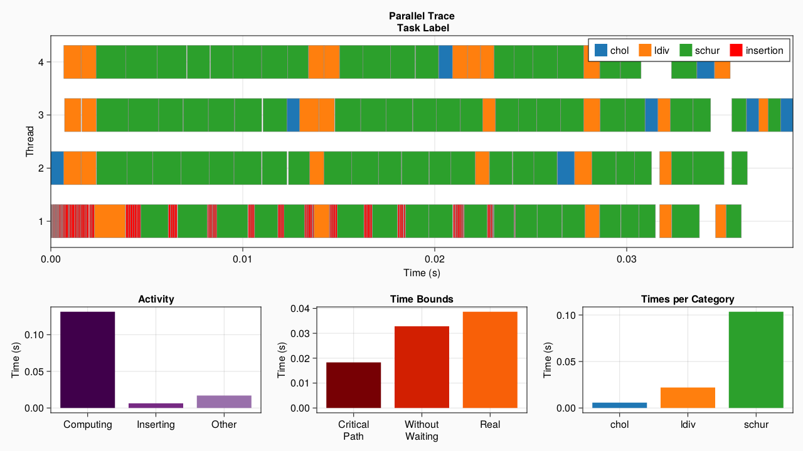
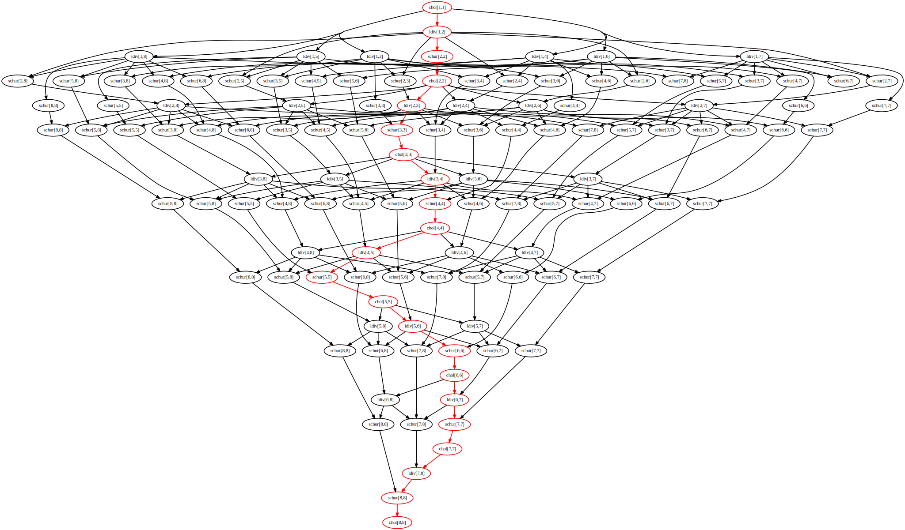

# [Tiled Cholesky factorization](@id tiledcholesky-section)

The Cholesky factorization algorithm takes a symmetric positive definite matrix A and finds a lower triangular matrix L such that `A = LLᵀ`. The tiled version of this algorithm decomposes the matrix A into tiles of even sizes. At each step of the algorithm, we do a Cholesky factorization on the diagonal tile, use a triangular solve to update all of the tiles at the right of the diagonal tile, and finally update all the tiles of the submatrix with a schur complement.

So we have 3 types of tasks : the Cholesky factorization (I), the triangular solve (II), and the schur complement (III).  
If we have a matrix A decomposed in `n x n` tiles, then the algorithm will have `n` steps. It implies that the step `i ∈ [1:n]` do `1` time (I), `(i-1)` times (II), and `(i-1)²` times (III). So respectively `O(n)` (I), `O(n²)` (II), and `O(n³)` (III). We will compare this result with the "Times Per Category" part of the visualization. We illustrate the 2nd step of the algorithm in the following image.


The code of the sequential yet tiled factorization algorithm will be :

```julia
tilerange(ti, ts) = (ti-1)*ts+1:ti*ts
function cholesky_dft!(A, ts)
    m,n = size(A)
    n%ts != 0 && error("Tilesize doesn't fit the matrix")
    tn = round(Int, n/ts)

    for ti in 1:tn
        ri = tilerange(ti, ts)

        # Diagonal cholesky serial factorization (I)
        cholesky!(view(A,ri,ri))

        # Left blocks update (II)
        L = adjoint(UpperTriangular(view(A,ri,ri)))
        for tj in ti+1:tn
            rj = tilerange(tj, ts)
            ldiv!(L, view(A,ri,rj))
        end

        # Submatrix update (III)
        for tj in ti+1:tn
            for tk in tj:tn
                rj = tilerange(tj, ts)  ;  rk = tilerange(tk, ts)
                mul!(view(A,rj,rk), adjoint(view(A,ri,rj)), view(A,ri,rk))
            end
        end
    end

    # Construct the factorized object
    return Cholesky(A,'U',zero(LinearAlgebra.BlasInt))
end
```

When it will come to actually parallelize the code, we would only have with DataFlowTasks to wrap function calls within a `@dspawn`, and add a synchronization point at the end. The parallelized code will be :

```julia
using DataFlowTasks
using LinearAlgebra
function cholesky_dft!(A, ts)
    m,n = size(A)
    n%ts != 0 && error("Tilesize doesn't fit the matrix")
    tn = round(Int, n/ts)

    for ti in 1:tn
        ri = tilerange(ti)

        # Diagonal cholesky serial factorization (I)
        @dspawn cholesky!(@RW(view(A,ri,ri))) label="chol ($ti,$ti)"

        # Left blocks update (II)
        L = adjoint(UpperTriangular(view(A,ri,ri)))
        for tj in ti+1:tn
            rj = tilerange(tj)
            @dspawn ldiv!(@R(L), @RW(view(A,ri,rj))) label="ldiv ($ti,$tj)"
        end

        # Submatrix update (III)
        for tj in ti+1:tn
            for tk in tj:tn
                rj = tilerange(tj)  ;  rk = tilerange(tk)
                @dspawn mul!(@RW(view(A,rj,rk)), @R(adjoint(view(A,ri,rj))), @R(view(A,ri,rk))) label="mul ($tj,$tk)"
            end
        end
    end
    DataFlowTasks.sync()
    # Construct the factorized object
    return Cholesky(A,'U',zero(LinearAlgebra.BlasInt))
end
```

The code below shows how to use this `cholesky_dft!` function, how to profile the program and get the most information from the visualization. 

```julia
import DataFlowTask as DFT

# DataFlowTasks environnement setup
DFT.reset!()
DFT.enable_log()
DFT.setscheduler!(DFT.JuliaScheduler(50))

# Context
n  = 2048
ts = 256
A = rand(n, n)
A = (A + adjoint(A))/2
A = A + n*I

# Compilation
cholesky_dft!(copy(A), ts)

# Reset environnement
DFT.resetlogger!()
GC.gc()

# Real work to be analysed
cholesky_dft!(A ,ts)

# Plot
DFT.plot(categories=["chol", "ldiv", "mul"])
```



We'll now see how we can use this visualization to understand the program and its progress.

### Setup
But first, let's look closely at the details that will make this code do a proper profiling. The steps are the following :
- `DataFlowTasks.enable_log()` needs to be called before the benchmark
- `First call` : the call on a copy of A will compile the function, otherwise the first time you'll run it, you will have false results
- `Reset environnement` : because of this call, you need to reset the environnement : all DataFlowTasks' stored informations must be cleaned. This is done with `resetlogger!()`
- `GC.gc()` : the garbage collector call is not a necessary step, but if you have a full REPL, the garbage collection might happen during your benchmark. The profiling visualization will then highlight it.

### Task colors : get an idea of the progress

We can see the algorithm's progress we described above : we have a first blue task (I), then O(n-i) orange (II), then O((n-i)^2) greens (III). We can see the repartition of the time depending on thoses categories we defined on the "Times per Category" plot. Using well choosen labels can increase readability a lot.

### Insertion Tasks

Red tasks represent the time spent inserting nodes in the graph. We specified a capacity of 50 nodes for the scheduler with the line `DataFlowTasks.setscheduler!(JuliaScheduler(50))
`. It means if we have 50 nodes in the DAG, the scheduler will wait until some tasks are finished to insert more nodes in the DAG. If we have too much node in the graph, the algorithm of insertion will cost more. Tests are needed to find the best capacity for each case. Note that the insertion tasks are always handled by the first thread.

### Time Bounds

The "Activity" and "Time Bounds" parts of the plots highlight the time spent waiting ("Other" and "Without Waiting" respectively). This time is in part due to the algorithm, in other part to the scheduler. To differentiate both effects, we must compare the three bars on the "Time Bounds" part.
- `Critical Path` : the time of the longest path in the DAG. It means if we had an infinite number of cores, we couldn't do better than this time : it's the algorithm that limits the parallelization.
- `Without Waiting` : this doesn't consider the algorithm at all.
Seeing here how the `Critical Path` bar is twice as small as the `Real` one tells us that we can't do better than a 2 times speedup. The `Without Waiting` tells us how much the threads are used. Because we know it's not the algorithm that limits us in that situation, it tells us directly the DataFlowTasks' overhead.

Note : The grey parts of the trace plot don't represent anything : it's the separator between all tasks (so they don't merge). Usually, the insertion tasks are very close to each other, and so there might be a lot a grey, and not that much of red. To avoid that, using GLMakie's interactivity, you can zoom on these parts to see exactly what's happening (the grey parts are adaptive).

### DAG

```julia
dagplot()
```



The more the DAG will be wide, the more it can be parallelized. The more it is thin, the less we are going to benefit from having a lot of cores. In this approach, even if there's a lot of nodes, it can be useful to plot the DAG to see its width. It's a visual complement to the "Critical Path" bar in the "Time Bounds" plot : the more this bar is small compared to the "real time", the more the DAG is wide.

The DAG can also be used with smaller versions of the algorithm, while in development : you can check exactly what's the order the program understood and if it's the correct one. The use of labels can help a lot in that process. Here is the DAG obtain with twice less tasks than before.


We can see that as the algorithm progresses, the DAG becomes thinner, and so the parallelization is less optimal. Indeed, we do notice more waiting times at the end of the trace plot than at the beginning.

