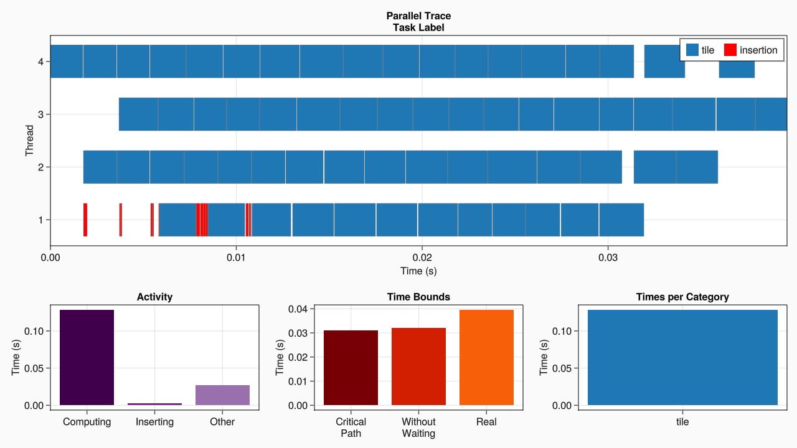

# Iterative Stencil Loop

The Gauss-Seidel algorithm uses the following five-points stencil :

$$v_{i,j}^{n+1} = \frac{1}{5}(v_{i,j-1}^{n+1} + v_{i,j-1}^{n+1} + v_{i,j}^n + v_{i+1,j}^n + v_{i,j+1}^n)$$ 

where the element $(i,j)$ of the matrix $v$ at time $n+1$ depend on values of the same iteration $n+1$. Those dependencies might be tricky to track, but, at each update, we know which elements it needs. So we know the access modes of the data.

We'll work on a matrix of size $(N+2)*(N+2)$, with $N*N$ real elements and a halo of zero surrounding them to simplify boundary conditions.

The update of a tile of the matrix is given by the next function :

```julia
# Update a tile of v composed by elements at index in range (ri,rj)
function step!(v, ri, rj)
    for i ∈ ri, j ∈ rj
        v[i,j] = 1/5 * (v[i-1,j] + v[i,j-1] + v[i,j] + v[i+1,j] + v[i,j+1])
    end
end
```

The sequential core of the algorithm by block will then be :

```julia
tilerange(ti, ts) = (ti-1)*ts+2:ti*ts+1
function gauss_seidel(v)
    m,n = size(v).-2
    tn = round(Int, n/ts)
    for ti ∈ 1:tn, tj ∈ 1:tn
        (ri,rj) = tilerange.([ti tj], ts)
        step!(v, ri, rj)
    end
end
```

And the parallelization with DataFlowTasks :

```julia
using DataFlowTasks
import DataFlowTasks as DFT

function core!(v, ts)
    m,n = size(v).-2
    tn = round(Int, n/ts)

    for ti ∈ 1:tn, tj ∈ 1:tn
        (ri,rj) = tilerange.([ti tj], ts)
        @dspawn begin
            @R view(v, ri[1]-1, rj)
            @R view(v, ri[end]+1, rj) 
            @R view(v, ri, rj[1]-1)
            @R view(v, ri, rj[end]+1)
            @RW view(v, ri, rj)
            step!(v, ri, rj)
        end label="tile ($ti,$tj)"
    end
    DFT.sync()
end
```

The final peaces of the code :

```julia
using GLMakie, GraphViz

function main()
    # Declaration
    N = 4096            # Nb of elements
    ts = 512            # Tilesize
    v = zeros(N+2,N+2)  # Matrix
    initialization!(v)  # Init a choc at the center
    DFT.enable_log()

    # Compilation
    gauss_seidel(copy(v), ts)

    # Reset DFT Environnement
    DFT.reset!()

    # Call
    gauss_seidel(v, ts)

    # Profile
    DFT.plot(categories=["tile"])
end
```

The profiling gives us the next results.



