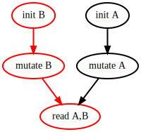

# [Profiling](@id visualization-section)

The visualization uses 2 main tools : one for plotting the parallel trace and other general information, and another for plotting the DAG :

* `plot(logger=getlogger(); categories)`
* `dagplot(logger=getlogger())`

Visualization tools, such as the packages they need, are not loaded by default. We are using `Requires.jl`, that allows us to ignore this part of DataFlowTasks when not needed. For example, when finished developing your package using DataFlowTasks, visualization tools won't be necessary. This way you won't carry useless code and packages.

So the first step to visualization will be to load the packages that will trigger the code loading.  
Again, 2 packages related to the 2 different visualizations : one of Makie backend for the general plot, and GraphViz for the dagplot.  
The next lines will load all of the visualization tools, and enable logging :

```julia
using CairoMakie, GraphViz
using DataFlowTasks

DataFlowTasks.enable_log()
```

Note: choosing GLMakie over CairoMakie will bring a bit of interactivity.

Let's illustrate the usage with a small example. Functions we'll be working with are written below.

```julia
using CairoMakie, GraphViz
using DataFlowTasks
using DataFlowTasks: plot

# Utility functions
init!(A) = (A .= rand())                # Write
mutate!(A) = (A .= exp.(sum(A).^2).^2)  # Read/Write
get(A,B) = A+B                          # Read

# Main work function
function work(A, B)
    # Initialization
    @dspawn init!(@W(A)) label="init A"
    @dspawn init!(@W(B)) label="init B"

    # Mutation
    @dspawn mutate!(@RW(A)) label="mutate A"
    @dspawn mutate!(@RW(B)) label="mutate B"

    # Final read
    @dspawn get(@R(A), @R(B)) label="read A,B"

    DataFlowTasks.sync()
end
```

Usually, when wanting to visualize the parallelization, you should do as follows :

```julia
# Context
A = ones(2000, 2000)
B = ones(2000, 2000)

# Compilation
# run your code once to avoid seeing artifacts related to compilation in your logged data
work(copy(A), copy(B))

# Start "real" profiling work in a clean environment
# - reset the internal logger state to discard data collected during previous runs
# - start from a clean memory state. If garbage collection happens during the
#   run, we'll know it's triggered by the real workload and the visualization will
#   highlight its impact.
resetlogger!()
GC.gc()

# Real Work
work(A, B)
```

The logger will get informations on the final call to work, the visualization is a post-processing of these data. We have finally :

```julia
using DataFlowTasks: plot, dagplot
plot(categories=["init", "mutate", "read"])
```


and the DAG's plot :
```julia
dagplot()
```




If you want to save the dag, the next utility function could be useful :

```julia
using DataFlowTasks: dagplot, savedag
g = dagplot()
savedag("filename.svg", g)
```

### Parallel Trace
The main plot is the parallel trace visualization. We can see on which thread the task was run, and the time it took.  
It also shows the time spent inserting nodes in the graph (DataFlowTasks' overhead), considered also in the plot as tasks, represented in red. Here there aren't a lot of tasks, so the `insertion tasks` aren't really visible. Using GLMakie allows zooming on the plot to search for those small tasks.
If the `garbage collector` is run while the work is ongoing, it will be shown in the plot.  


### Labels
We see we can label our tasks for the plot to be clearer and to carry more information, although it is not necessary : a call to `plot()` without arguments, or not specifying labels on tasks creations, is absolutely possible.

The labels given to the `categories` plot's argument work as substrings : if a task's label is "work on A", and the label given in categories is "work", because the substring can be found in the task label, it will go in that category.

The longer label isn't useless though. When using GLMakie, the plot will be a little more interactive : when hovering on a task trace, under the plot's title will be written the full task label. Also, the nodes' names of the DAG's plot will be those task labels, as we can see above.

### Activity plot

This barplot gives us information on the parallelization results.
* `Computing` will be the time spent doing the work given by the user in the tasks.
* `Inserting` will be the time spent inserting nodes in the DAG (DataFlowTasks' overhead), it also carries the garbage collector time when it's called.
* `Other` represents the time waiting.

All those times are cumulative of all threads.

### Time Bounds

We give post-processed time bounds to give additional information on the parallelization.

The `critical path`, which is the red path in the DAG's plot (see above), is the sum of the duration of the tasks constituting the critical path. It means that even if we had an infinite number of cores, we couldn't exceed this time because of the algorithm.

The `without waiting` post-processed time gives the time it would have taken if we hadn't waited at all (it's the sum of all of the task's duration divided by the number of threads).

We can't have a smaller time than those 2 boundaries.

### Times per Category

As discussed above, if a task has a substring given in the plot's argument in its label, then the task will be associated with this substring. For example : the task "init A" will go in the category "init".

The times represented by the barplot are the sum of the task's duration for each category.

Note : be careful with giving similar labels. If tasks have "R" and "RW" labels, and the substrings given to the plot's argument are also "R", and "RW", then all tasks will be in the category "R" (because "R" can be found in "RW"). The "RW" will be right though.